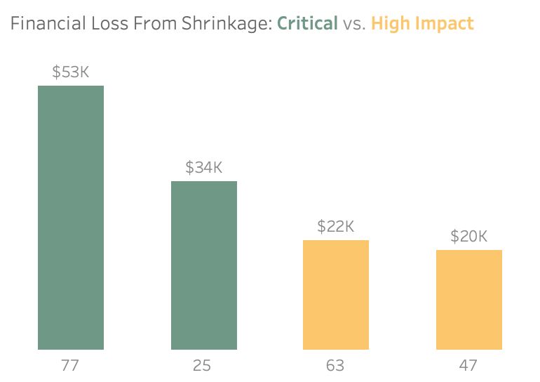
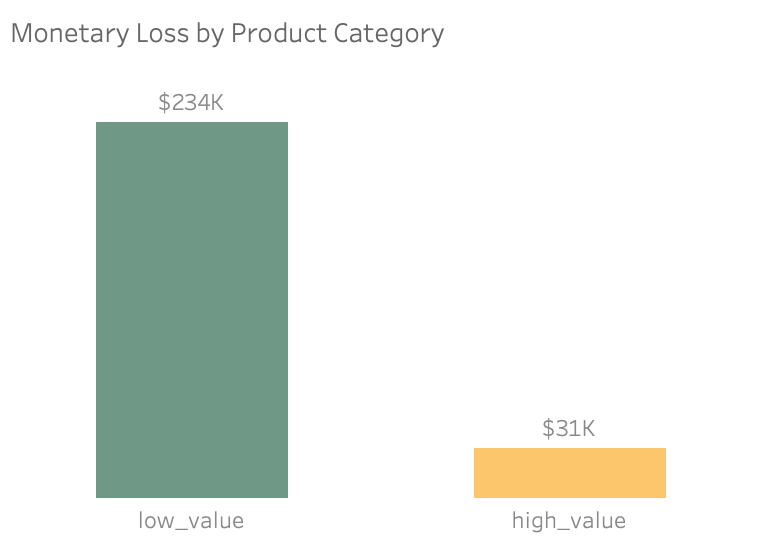
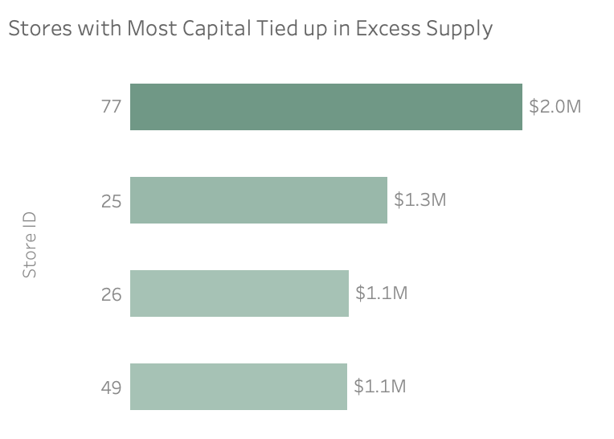
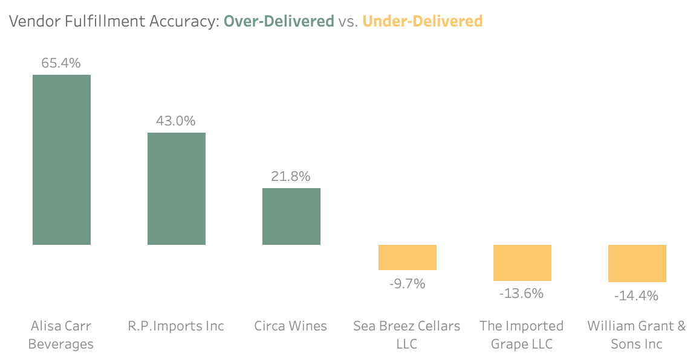
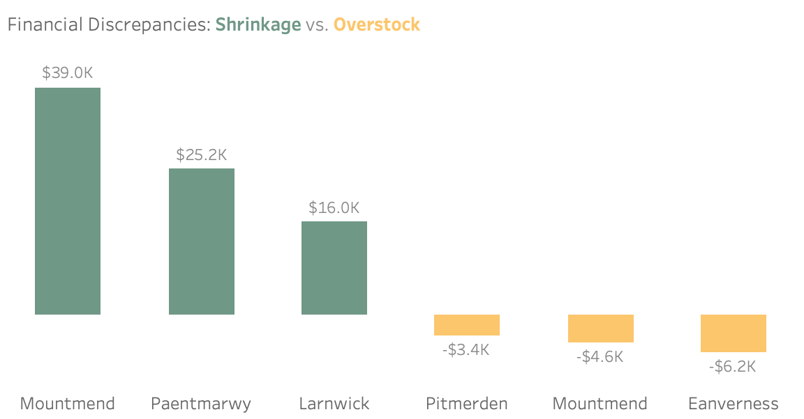

# Retail Shrinkage & Inventory Optimization Analysis — Bibitor LLC
## Business Context
Bibitor LLC is a retail wine and spirits company operating ~80 stores across the fictional state of Lincoln. Annual sales range between \$420–450M, with COGS around \$300–350M. Despite strong revenue, store-level shrinkage (unexplained inventory loss) was increasing, reducing profit margins and creating stock imbalances: some stores were overstocked, while others frequently ran out of top-selling products.

> **The Challenge:** Identify where inventory is disappearing, what's tying up capital, and which operational failures are driving both issues.

## 🎯 Executive Summary
This analysis identifies two major financial risks impacting Bibitor LLC: 
- $199K in direct annual shrinkage losses
- $28M in capital tied up in slow-moving inventory

Key findings show that 65% of all shrinkage is localized in just four high-risk stores (notably Store 77 and Store 25), which also suffer from the highest levels of excess inventory.  
Additionally, systemic stock imbalances are being worsened by significant vendor fulfillment inaccuracies, including a 35K unit delivery variance from William Grant & Sons Inc.   
By focusing audits on high-risk locations and enforcing vendor accountability, Bibitor LLC can release millions in trapped capital and stabilize profit margins.  
**View Dashboard** [here.](https://public.tableau.com/app/profile/ayeshazubair/viz/RetailShrinkageInventoryAnalysisBibitorLLC/bibitor_dashboard)

## 📊 Key Findings & Business Implications
#### 1. Shrinkage Is Highly Concentrated: Four Stores Drive Nearly Two-Thirds of Total Loss
Inventory shrinkage is highly concentrated rather than evenly distributed across the chain. Four locations—Stores 77, 25, 63, and 47—account for approximately **\$129K**, or 65%, of the total \$200K annual revenue loss. These stores represent a combined \$94K in direct cost exposure and an additional $35K in lost margin, indicating that shrinkage impact extends well beyond inventory write-offs. Store 77 presents the highest financial risk, with over \$53K in exposure, likely amplified by its operational complexity and large SKU assortment (7,344 SKUs).

**Business Implication:** Shrinkage is concentrated rather than systemic. Because unrealized margin exceeds direct write-offs, the true financial impact is understated in accounting records. The concentration allows leadership to focus audits and controls on a small set of high-impact stores instead of applying broad, inefficient interventions.



#### 2. Operational Leakage Dominates: Low-Value Items Drive 88% of Shrinkage Value
While high-value products show a slightly higher average loss rate, low-value items account for **88%** of total shrinkage value (\$233K of $264K). Shrinkage is therefore driven primarily by high-volume, low-priced SKUs rather than concentrated losses in premium products.

**Business Implication:** The dominance of low-value items in total shrinkage suggests that operational factors—such as receiving errors, miscounts, breakage, and inventory recording gaps—are likely major contributors to loss. Interventions focused solely on high-value theft prevention would address only a small portion of total exposure; broader process controls are required to materially reduce shrinkage.



#### 3. Capital Inefficiency Represents the Largest Structural Risk: $28M Locked in Slow-Moving Inventory
Across the network, 8,198 distinct SKUs exceed 90 days of supply, tying up approximately **\$28M** in working capital (calculated as the sum of inventory value across all affected SKUs). Excess inventory is highly concentrated, with four stores (77, 26, 49, and 25) alone accounting for approximately \$5.5M in tied-up capital. Store 77 is the single largest contributor, holding nearly \$2M in slow-moving stock.  
Liquidity risk is most severe in Stores 64, 77, 40, and 49, where inventory-weighted average days of supply exceed 700+ days, indicating prolonged stagnation. 

**Business Implication:** Inventory inefficiency poses a larger structural risk than shrinkage. At an 8% cost of capital, excess stock generates ~$2.24M in annual opportunity cost, while prolonged holding periods increase damage and obsolescence risk. Unlike shrinkage, this exposure compounds over time.



#### 4. Vendor Delivery Inaccuracies Create Systemic Stock Imbalances
Inventory variance is concentrated among specific vendors rather than occurring randomly. William Grant & Sons Inc shows cumulative under-deliveries exceeding 35,000 units, while Alisa Carr Beverages over-delivered by approximately 65% relative to ordered quantities. These deviations are consistent across multiple products, indicating persistent fulfillment inaccuracies.

**Business Implication:** Vendor delivery reliability is a direct driver of inventory imbalance. Under-delivery creates stockouts and lost sales, while over-delivery increases capital lock-up. Because variance is concentrated among a small number of suppliers, this represents a manageable counterparty risk rather than a systemic supply-chain failure.



#### 5. Geographic Patterns Reveal Distinct Operational Failure Modes
Losses cluster geographically. Mountmend (Store 77) and Paentmarwy (Store 25) together account for over **\$64K** in shrinkage. In contrast, locations such as Eanverness (Store 49) and Pitmerden (Store 40) exhibit significant overstock relative to recorded deliveries.

**Business Implication:** Operational failures are not uniform across the network. Loss-heavy cities indicate breakdowns in inventory control or security, while overstock-heavy locations suggest receiving and recording failures. This heterogeneity invalidates one-size-fits-all solutions and highlights the need for differentiated operational diagnosis.



## 🚀 Recommended Action Plan
#### 1. Stabilize Inventory Where Risk Concentrates
##### Phase 1.1 - High-Risk Stores (Immediate Focus)
**Target Stores:** 77, 25, 26, 49    
**Rationale:** These locations are repeatedly flagged across shrinkage exposure, excess days of supply, and overstock indicators, signaling compounding inventory risk rather than isolated variance. Addressing these stores first delivers the highest financial return by reducing margin erosion, releasing tied-up capital, and preventing further operational leakage.

**🔍 Actions & Execution:**
* Perform focused inventory reconciliations to identify root discrepancies
* Tighten receiving and stock movement controls, particularly for high-volume SKUs
* Introduce short-cycle counts for slow-moving and variance-prone items
* Temporarily restrict replenishment for SKUs exceeding 90 days of supply

**✅ Success Metrics:**
* Reduction in shrinkage rate within subsequent inventory cycles
* Decline in inventory average days of supply
* Measurable reduction in excess inventory value

##### Phase 1.2 - Moderate-Risk Stores (Targeted Controls)
**Target Stores:** 63, 47, 50, 45  
**Rationale:** These stores exhibit material risk in a single dimension—either elevated shrinkage or excess inventory volume—but have not yet developed compounding failure patterns. Early, targeted controls reduce the likelihood of escalation into high-risk profiles observed in Phase 1 locations.

**🔍 Actions & Execution:**
* Apply standardized inventory controls validated in Phase 1
* Monitor shrinkage and days-of-supply trends on a rolling basis
* Escalate stores showing worsening indicators to Phase 1 protocols

**✅ Success Metrics:**
* Stabilization of shrinkage and inventory levels
* No progression into multi-risk categories over time

#### 2. Reduce Shrinkage by Fixing Process Leakage in Low-Value Products
**Target Category:** Low-value products  
**Rationale:** Low-value products contribute approximately **\$233K** in shrinkage value and account for the highest number of units lost. While high-value items show a marginally higher loss rate, low-value products represent the dominant driver of total shrinkage due to their scale.

**🔍 Actions & Execution:**
* Strengthen receiving and quantity verification for low-value items
* Increase cycle count frequency for discrepancy-prone SKUs
* Standardize handling and shelf-replenishment practices to reduce breakage and misplacement
* Monitor recurring SKU-level discrepancies to identify process gaps

**✅ Success Metrics:**
* Reduction in total shrinkage value from low-value products
* Improved inventory accuracy for low-value SKUs
* Fewer recurring discrepancies across inventory cycles

#### 3. Improve Inventory Accuracy by Enforcing Vendor Delivery Accountability
**Target Area:** Vendors with persistent over-delivery and under-delivery patterns  
**Rationale:** Inventory variance is concentrated among a small number of vendors rather than occurring randomly across the supplier base. Persistent under-delivery contributes to stockouts and lost sales, while over-delivery increases excess inventory, capital lock-up, and downstream shrinkage risk. Addressing these vendors directly offers a high-leverage opportunity to stabilize inventory accuracy without broad supply-chain disruption.

**🔍 Actions & Execution:**
* Introduce vendor-level delivery accuracy tracking using ordered vs received quantities
* Flag vendors with repeated deviations beyond acceptable tolerance thresholds
* Require enhanced receiving verification for high-variance vendors
* Use variance trends to inform corrective actions, contract discussions, or order adjustments

**✅ Success Metrics:**
* Reduction in delivery variance rates for targeted vendors
* Fewer stock discrepancies linked to vendor receipts
* Improved alignment between ordered and received quantities over time

## Methodology & Analytical Approach
**1. Performance Optimization:** To handle high-volume tables (12M+ sales records), I implemented Materialized Views and B-Tree Indexing on primary and foreign keys. This strategy significantly reduced query execution time by pre-aggregating core metrics and improving data retrieval efficiency.  
**2. Code Modularization:** Utilized CTEs (Common Table Expressions) to ensure the analytical pipeline is modular, readable, and maintainable. This approach allowed for complex multi-step calculations to be audited easily.  
**3. Weighted Valuation:** Preferred Weighted Averages over naive averages for sale and purchase prices. This ensures that high-volume transactions carry appropriate mathematical weight, preventing low-volume price outliers from skewing the final financial results.  
**4. Core Shrinkage Framework:** Developed a standardized three-pillar calculation for every business question to ensure consistency:  
Unit Loss: Physical discrepancy in inventory.  
Monetary Impact: Total dollar-value exposure.  
Percentage Impact: Loss rate relative to total volume or value.  
**5. Data-Driven Thresholding:** In the absence of predefined industry benchmarks, I used the PERCENTILE_CONT function to perform a deep distribution analysis of the data.  
**6. Risk Categorization:** Final segmentation (e.g., Critical vs. High-Impact) was derived by testing multiple percentiles (P75, P91, P96). This allowed me to identify the "elbow point"—the specific threshold where financial risk and exposure significantly accelerate.  

## Operational Risk & Performance Indicators
| Metric 						| Value 					| Business Context 	                                    |					
|:--------						|:-------					|:------------------								    |
| **Total Shrinkage Loss** 		| $199K 					| Annual revenue impact across 41 stores 			    |
| **Capital Trapped** 			| $28M			 			| Total value of inventory exceeding the 90-day supply threshold 					    |
| **Worst Performing Store**	| Store 77 		| Accounts for $53K in loss; ranks 1st in shrinkage despite 6th in sales   |
| **Top Vendor Issue**			| -14.44% 	| William Grant & Sons Inc under-delivered by 35.9K units 			    |
| **Loss Concentration**		| 65%    	| $129K of total losses are localized within just 4 key stores 			    |
| **Product Pattern** 			| 88%  | Loss is dominated by low-value items, suggesting process errors over theft. 					|

**Why These Metrics Matter:** They bridge the gap between operational data (units lost) and business outcomes (profit impact), making insights actionable for decision-makers.

## 🛠️ Tech Stack & Data Architecture

**Tools:** PostgreSQL • DBeaver • Tableau  
**Dataset:** 15M+ records - [Hub of analytics education](https://www.hubae.org/datvironment/bibitor/)  
**Architecture:** Raw → Clean → Gold (medallion approach)
**Data Flow:**
```
Raw CSV Files (6 tables: stores, products, vendors, inventory, sales, purchases)
    ↓
Clean Layer (Views: deduplication, validation, type casting)
    ↓
Gold Schema (Star schema with materialized aggregations)
```
**Why This Architecture:** The Gold schema ensures consistent business definitions across all downstream analysis—mimicking the semantic layer approach used by enterprise retail analytics teams.  
Detailed technical documentation [here.](data_catalog.md)

## Future Analysis Opportunities
**1-** Incorporate monthly sales trends to calculate dynamic safety stock levels, moving away from a fixed 90-day threshold to better manage seasonal demand spikes and holiday volatility.

**2-**  Integrate store-level labor hours and employee turnover data to determine if high shrinkage rates in specific locations correlate with staffing shortages or training gaps in inventory receiving protocols.

**3-** Investigate the root cause of the 35K-unit vendor discrepancy by looking into delivery logs and warehouse records to see if the missing stock is due to paperwork errors, shipping issues, or physical loss.

## ⚠️ Limitations & Assumptions
**1. Synthetic Dataset:** As this project utilizes a fictional dataset, there is no specific operational details such as store layouts, staffing levels, cycle-count frequencies or security logs that would be needed for a root-cause analysis.  
**2. Temporal Granularity:** Inventory data was limited to annual snapshots (Start-of-Year and End-of-Year). This constraint prevented the analysis of month-to-month shrinkage trends, quarterly fluctuations, or specific "out-of-stock" periods.  
**3. Standardized Sales Velocity:** The Days of Supply (DOS) calculation assumes a steady sales pace throughout the year. This is a high-level benchmark and does not account for holiday spikes or seasonality, which would change the speed of sales in a real business environment.  
**4. Benchmark Proxies:** The 90-day supply threshold and specific percentile benchmarks were established through internal data distribution analysis. These serve as logical proxies for business risk in the absence of internal company-defined KPI granularity.  
**5. Data Scope:** The analysis focuses exclusively on products with recorded sales and inventory movement; items with zero activity throughout the period were excluded to maintain the integrity of the "burn rate" calculations.  

## 📁 Project Structure
```
bibitor_llc/
├── License.txt
├── README.md
├── bibitor_viz.twb
├── data_catalog.md
├── docs/
│   ├── 01_schema_layers.svg
│   ├── 02_ERD_bibitor_llc.svg
│   ├── images/
│   └── results/
└── sql/
    ├── 01_ddl/
    ├── 02_load/
    ├── 03_test/
    ├── 04_analytics/
    └── db_init.sql
```

### 📬 Feel Free to Connect
[](mailto:ayeshazubair.contact@gmail.com) [](https://www.linkedin.com/in/ayeshazubair-az/) [](https://ayeshazubair1.github.io/portfolio/projects/retail-shrinkage-analysis.html) [](https://public.tableau.com/app/profile/ayeshazubair/vizzes)

### 📄 License
This project is licensed under the MIT License. See the [License](License.txt) file for details.