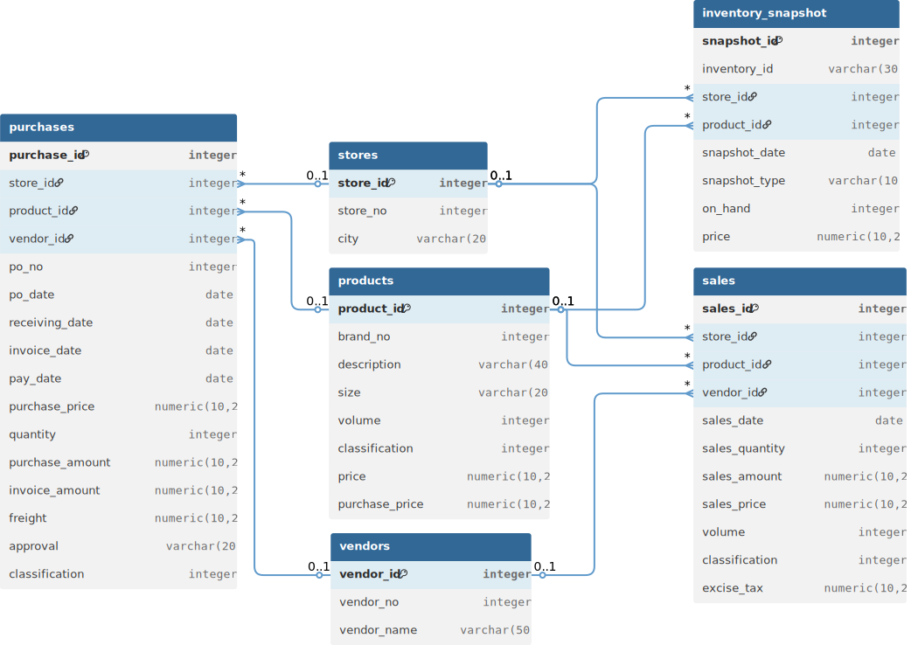

> This documentation provides a comprehensive, end-to-end overview of the data lifecycle—from raw ingestion and quality assessment to the final analytical modeling in the Gold layer.

## Dataset Overview
The Bibitor LLC dataset represents a large-scale fictional retail wine and spirits company operating approximately 80 stores across the state of Lincoln. It provides comprehensive transactional data capturing end-to-end operations, including product sales, purchases, vendor details, pricing, and inventory snapshots (beginning and ending). The dataset spans the full calendar year of 2016 (January 1 to December 31). It comprises 6 relational tables with over 13 million records, primarily driven by detailed sales transactions.

#### Data Source
The original raw CSV files and supporting materials can be downloaded from PwC's Data Analytics Case Studies page [here](https://www.pwc.com/us/en/careers/university-relations/data-and-analytics-case-studies-files.html).
**Note**: The dataset was originally created by the HUB of Analytics Education [HUB AE](https://www.hubae.org/datvironment/bibitor/?referrer=grok.com) at Northeastern University and is distributed by PwC for educational purposes.

#### Approach / Data Pipeline

### 1- Raw Data Ingestion: 
After downloading the dataset, I set up a dedicated PostgreSQL database and created a `raw` schema to store the data in its original, unprocessed form. 
- Wrote `CREATE TABLE` scripts for all **6 tables**, intentionally mirroring the exact structure of the source files (preserving original table/column names and data types `VARCHAR`, `REAL`, `INTEGER`)
- Loaded the data using PostgreSQL's `COPY` command within stored procedures for an efficient bulk-loading mechanism for the CSV files.

#### Data Quality Assessment
Once the data was successfully loaded into the `raw` schema, I conducted comprehensive quality checks across all six tables to identify any data integrity issues that could impact the  analysis. This assessment revealed several data quality problems, including null values, inconsistent formatting and standardization issues, unwanted leading or trailing spaces, missing values, and calculation discrepancies where computed fields didn't match their underlying source values. These findings helped clean and prepare the data so it could be trusted for analysis.
The issues found in data is listed below:

| Table Name                   | Column Name       | Issue Identified                       | Fix Applied                    |
|------------------------------|-------------------|----------------------------------------|--------------------------------|
| 2017PurchasePricesDec        | Size, Volume      | Inconsistent/empty values              | normalize_size(), NULLIF()     |
|                              | VendorName        | Leading/trailing spaces                | TRIM(), LOWER()                |
| beginvfinal12312016          | Size              | Inconsistent values                    | normalize_size()               |
| endinvfinal12312016          | City              | Inconsistent casing                    | INITCAP(), LOWER()             |
|                              | Size              | Inconsistent values                    | normalize_size()               |
| invoicepurchases12312016     | VendorName        | Leading/trailing spaces                | TRIM(), LOWER()                |
| purchasesfinal12312016       | Size              | Inconsistent values                    | normalize_size()               |
|                              | VendorName        | Leading/trailing spaces                | TRIM(), LOWER()                |
|                              | Dollars           | Calculation mismatch                   | PurchasePrice × Quantity       |
| salesfinal12312016           | Size              | Inconsistent values                    | normalize_size()               |
|                              | VendorName        | Leading/trailing spaces                | TRIM(), LOWER()                |
|                              | SalesDollars      | Calculation mismatch                   | SalesPrice × SalesQuantity     |

**Note:** normalize_size() is a custom user-defined function created to standardize size formats across different units (ml, L, oz, gal) into a consistent ml format.

### 2- Reusable Clean Layer (Standardized Views)
After identifying quality issues, I created a clean schema with transformation scripts to address all documented problems. The cleaned data was stored as views rather than physical tables, preserving the original structure while applying necessary fixes.
**Why views, not physical tables?** Views were chosen over physical tables because the data was not yet analysis-ready and would be further modeled in gold layer. This approach avoided unnecessary data duplication and kept the pipeline flexible for future transformations.

### 3- Gold Layer / Analytical Modeling
After storing the cleaned transformed data into views, I created a gold schema and transformed the six raw tables into a star schema optimized for business analysis. This involved complete restructuring: renaming tables and columns to business-friendly names, establishing proper relationships with primary and foreign keys, and consolidating relevant attributes from multiple source tables into each dimension and fact table.

### Table Descriptions
Table Name: **Stores (Dimension)**
Rows / Columns: **80 / 3**

| Column   | Description |
|----------|-------------|
| store_id | Unique identifier for each store location. |
| store_no | Internal reference number assigned by Bibitor LLC. |
| city     | City where the store operates. |

---

Table Name: **Products (Dimension)**
Rows / Columns: **12K / 8**
| Column         | Description |
|----------------|-------------|
| product_id     | Unique identifier for each product. |
| brand_no       | Brand reference number linked to the product. |
| description    | Product name or short description printed on the label. |
| size           | Package size label as shown on the product (e.g., “750ml”). |
| volume         | Product volume in milliliters (numeric form of size). |
| classification | Product category code (e.g., 1 = Spirits, 2 = Wines/Beers). |
| price          | Retail selling price of the product for customers. |
| purchase_price | Cost price paid by Bibitor LLC to vendors. |

---

Table Name: **Vendors (Dimension)**
Rows / Columns: **134 / 3**
| Column      | Description |
|-------------|-------------|
| vendor_id   | Unique identifier for each vendor or supplier. |
| vendor_no   | Internal vendor reference number used by Bibitor LLC. |
| vendor_name | Official name of the vendor or supplier company. |

---

Table Name: **Inventory_Snapshot (Fact)**
Rows / Columns: **431K / 8**

| Column        | Description |
|---------------|-------------|
| snapshot_id   | Unique identifier for each inventory record. |
| inventory_id  | Composite reference combining store and product. |
| store_id      | Store where inventory is being tracked. |
| product_id    | Product tracked in the inventory. |
| snapshot_date | Date when the inventory level was recorded. |
| snapshot_type | Snapshot type — typically “start” or “end” of day. |
| on_hand       | Number of product units available in stock. |
| price         | Product price at the time of the snapshot. |

---

Table Name: **Purchases (Fact)**
Rows / Columns: **2M / 16**
| Column            | Description |
|------------------|-------------|
| purchase_id       | Unique identifier for each purchase transaction. |
| store_id          | ID of the store making the purchase. |
| product_id        | ID of the purchased product. |
| vendor_id         | ID of the vendor supplying the product. |
| po_no             | Purchase order number created by Bibitor LLC. |
| po_date           | Date when the purchase order was created. |
| receiving_date    | Date when purchased goods were received at the store. |
| invoice_date      | Date when the vendor issued the invoice for this purchase. |
| pay_date          | Date when Bibitor LLC paid the vendor’s invoice. |
| purchase_price    | Unit price paid per product on this purchase. |
| purchase_quantity | Number of product units purchased. |
| purchase_amount   | Total purchase value (quantity × purchase price). |
| invoice_amount    | Total invoice value billed by the vendor. |
| freight           | Shipping or freight charges for the order. |
| approval          | Purchase approval status or note (e.g., approved, pending). |
| classification    | Category of the purchased product (matches product classification). |

---

Table Name: **Sales (Fact)**
Rows / Columns: **13M / 11**
| Column        | Description |
|---------------|-------------|
| sales_id      | Unique identifier for each sales transaction. |
| store_id      | ID of the store where the sale occurred. |
| product_id    | ID of the product sold. |
| vendor_id     | ID of the vendor associated with the product sold. |
| sale_date     | Date when the sale was made. |
| sale_quantity | Quantity of items sold. |
| sale_amount   | Total revenue from the sale (sale_quantity × sale_price). |
| sale_price    | Selling price per unit at the time of sale. |
| volume        | Product volume (e.g., 750ml). |
| classification | Product category code. |
| excise_tax    | Alcohol excise tax charged per sale. |

---
**SQL Scripts:**
DDL scripts [here](sql/01_ddl)
Data Load scripts [here](sql/02_load)
Data Quality Checks [here](sql/03_test)
Database init [here](sql/db_init.sql)