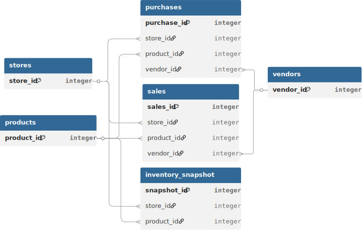

> This document outlines the technical implementation of the project, from raw data ingestion and quality assessment to analytical modeling and SQL optimization.

## Dataset Overview
A large-scale fictional retail wine and spirits company operating 80 stores across the state of Lincoln. It provides comprehensive transactional data covering end-to-end operations, including product sales, purchases, vendor details, pricing, and inventory snapshots (beginning and ending). The dataset spans the full calendar year of 2016 (January 1 to December 31). It consists of 6 relational tables with over 13 million records, primarily driven by detailed sales transactions.   
Download Dataset [here](https://www.pwc.com/us/en/careers/university-relations/data-and-analytics-case-studies-files.html)

### Tech Stack & Data Architecture
**Tools:** PostgreSQL • DBeaver • Tableau   
**Architecture:** Medallion (Raw → Clean → Gold)   
```
Raw Tables
   ↓
Clean Layer → Standardized views (validation, deduplication, type casting)
   ↓
Gold Layer → Star schema (physical tables) + materialized views
```
**Why this setup:** Ensures consistent business definitions across all analyses and enables scalable, fast query performance through pre-aggregated models and a semantic-like Gold layer.   

#### Data Pipeline


### 1- Raw Data Ingestion: 
After downloading the data files, a dedicated PostgreSQL database was set up and a `raw` schema was created to store the data in its original, unprocessed form.

**Data Quality Assessment:** Once the data was successfully loaded into the `raw` schema, comprehensive quality checks were conducted across all six tables to identify data integrity issues. This assessment revealed several data quality problems, including null values, inconsistent formatting, standardization issues, and calculation discrepancies etc.   

**Issues found:**

| Table                        | Column            | Issue                                  | Fix Applied                    |
|------------------------------|-------------------|----------------------------------------|--------------------------------|
| 2017PurchasePricesDec        | Size, Volume      | Inconsistent/empty values              | normalize_size(), NULLIF()     |
|                              | VendorName        | Leading/trailing spaces                | TRIM(), LOWER()                |
| beginvfinal12312016          | Size              | Inconsistent values                    | normalize_size()               |
| endinvfinal12312016          | City              | Inconsistent casing                    | INITCAP(), LOWER()             |
|                              | Size              | Inconsistent values                    | normalize_size()               |
| invoicepurchases12312016     | VendorName        | Leading/trailing spaces                | TRIM(), LOWER()                |
| purchasesfinal12312016       | Size              | Inconsistent values                    | normalize_size()               |
|                              | VendorName        | Leading/trailing spaces                | TRIM(), LOWER()                |
|                              | Dollars           | Calculation mismatch                   | PurchasePrice × Quantity       |
| salesfinal12312016           | Size              | Inconsistent values                    | normalize_size()               |
|                              | VendorName        | Leading/trailing spaces                | TRIM(), LOWER()                |
|                              | SalesDollars      | Calculation mismatch                   | SalesPrice × SalesQuantity     |

**Note:** normalize_size() is a custom user-defined function created to standardize size formats across different units (ml, L, oz, gal) into a consistent ml format.    

### 2- Reusable Clean Layer (Standardized Views)
After identifying quality issues, a clean schema was created with transformation scripts to address all documented problems. The cleaned data was stored as views rather than physical tables, preserving the original structure while applying necessary fixes.  
**Why views, not physical tables?** Views were chosen over physical tables because the data was not yet analysis-ready and would be further modeled in the gold layer. This approach avoided unnecessary data duplication and kept the pipeline flexible for future transformations.   

### 3- Gold Layer / Analytical Modeling
After storing the cleaned transformed data into views, a gold schema was created and the six tables were transformed into a star schema optimized for business analysis. This involved complete restructuring: renaming tables and column names, establishing proper relationships with primary and foreign keys, and consolidating relevant attributes from multiple source tables into each dimension and fact table.

<br>
  


## Analytical Methodology
**1. Performance Optimization:** Materialized views and B-tree indexing were used on large tables (~12M+ records) to speed up queries and pre-aggregate core metrics.   
**2. Data Modeling:** A medallion architecture (Raw → Clean → Gold) was implemented, with a star schema in the Gold layer for consistent analytics.   
**3. Query Design:** Used CTEs to simplify complex transformations and improve readability.     
**4. Metric Standardization:** A core shrinkage framework was applied across all analysis: unit loss, monetary impact, and percentage impact.   
**5. Weighted Calculations:** Weighted averages were used for pricing metrics to avoid distortion from low-volume transactions.     
**6. Thresholding Approach:** PERCENTILE_CONT was used to derive data-driven risk thresholds in the absence of external benchmarks.    
**7. Risk Segmentation:** Store and product risk tiers were defined using percentile testing (P75–P96) to identify high-risk breakpoints.   

---

**SQL Scripts:**  
DDL [here](sql/01_ddl)   
Database initialization [here](sql/db_init.sql)    
Data loading [here](sql/02_load)   
Data Quality Checks [here](sql/03_test)    
Analytics queries [here](sql/04_analytics)